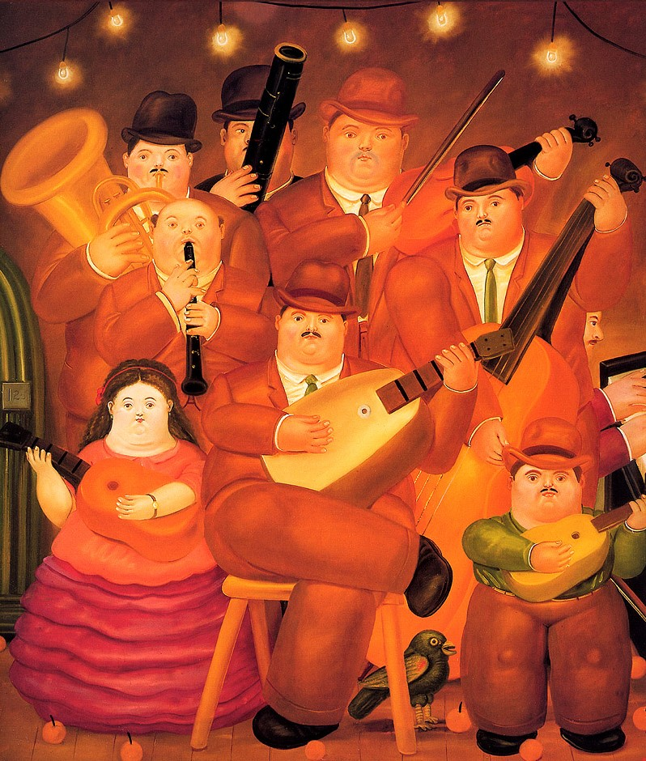
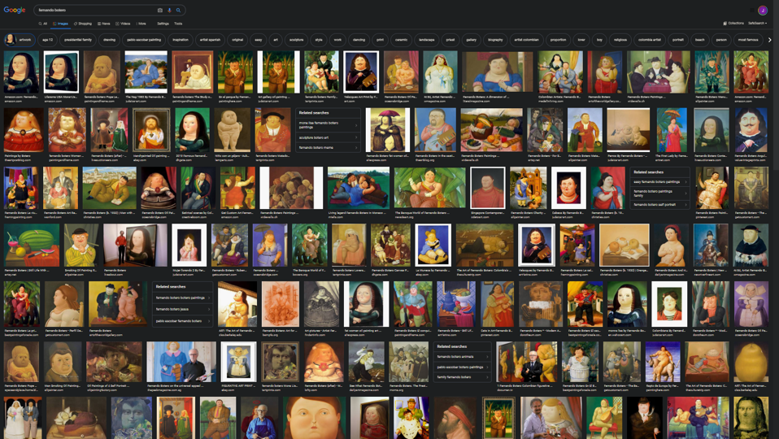

# Art and film color decomposition

#### Related Instagram posts
* https://www.instagram.com/p/Bm-3tyjhAyM/
* https://www.instagram.com/p/Bm-4zQjhwz5/
* https://www.instagram.com/p/Bm-5tIkhSgI/

This project grew out of a basic question: what are the colors that Fernando Botero, a famous Colombian painter and scultpter, uses in "Los Musicos"?

  

This lead to a natural next question: how do these colors compare to his other paintings?

  

Then of course: how does Botero compare to other painters?

[standalone R file](binary_posters--shiny_app.R).

You can find the live app here: https://roguedatascience.shinyapps.io/binary_images/

To better understand the functionality of the tool, it's super helpful to look at the following examples. You can find the high definition images as well as the app settings needed to produce them here: [El Pibe Valderrama example](pibe_example).

### Original image 

  

### Edited images

  

