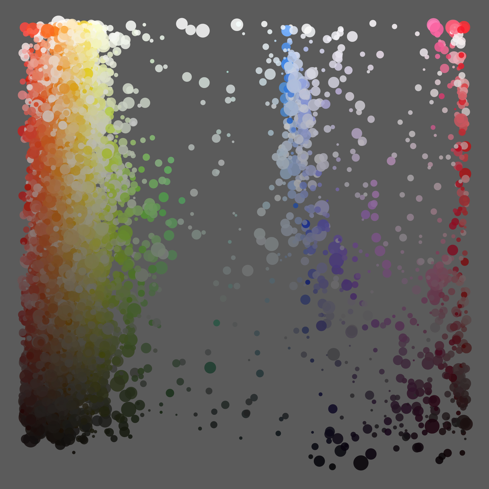
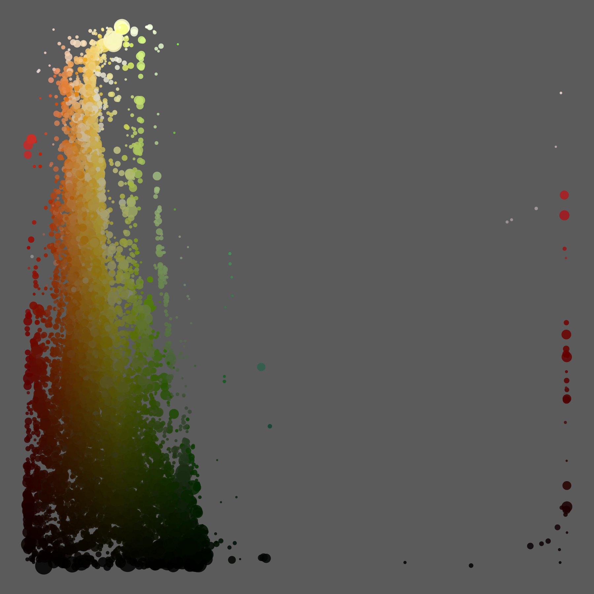
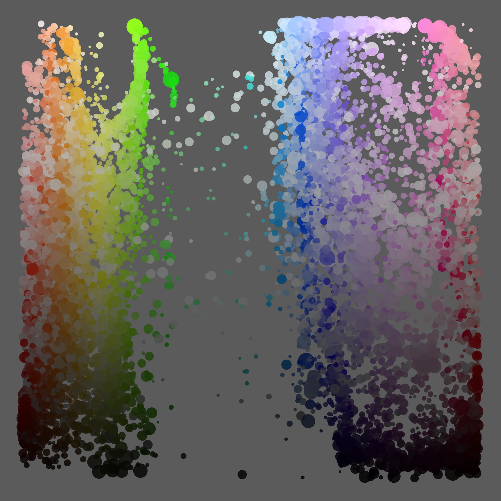

# Art and film color decomposition

#### Related Instagram posts
* https://www.instagram.com/p/Bm-5tIkhSgI/
* https://www.instagram.com/p/Bm-4zQjhwz5/
* https://www.instagram.com/p/Bm-3tyjhAyM/

This project grew out of a basic question: what are the colors that Fernando Botero, a famous Colombian painter and scultptor, uses in "Los Musicos"?

  

This lead to a natural next question: how do these colors compare to his other paintings?

  

Then of course: how does Botero compare to other painters?

To answer these questions, I developed an algorithm that extracts (usins k-means clustering at its core) and consistently graphs the the main colors from a group of images. These images can be, for example, the life work of a painter, like Botero. They can also be the trailer of movie or the opening credits of a TV show (for these, the videos were sampled for still images).

Here are some examples:

#### Fernando Botero

  

#### Amelie (trailer)

  

#### The Fresh Prince of Bel-Air (opening credits)

  

The full code for the color decomposition of Botero's work can be found here: [Boter example](botero_example). You can also find the high definition visualizations for [artists](gallery/artists), [trailers](gallery/trailers) and [TV show opening credits](gallery/tv_show_openings).
